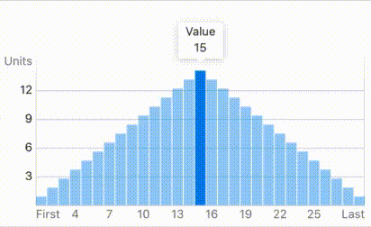
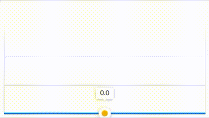

# react-native-slide-charts

[](https://www.npmjs.com/package/react-native-slide-charts)
[](https://www.npmjs.com/package/react-native-slide-charts)

`react-native-slide-charts` uses [`react-native-svg`](https://github.com/react-native-community/react-native-svg), [`d3`](https://github.com/d3/d3), and [`react-native-gesture-handler`](https://github.com/software-mansion/react-native-gesture-handler) to create highly customizable interactive charts that animate smoothly via [`Direct Manipulation`](https://facebook.github.io/react-native/docs/direct-manipulation).

## [Check out the demo on expo](https://snack.expo.io/@nhannah/react-native-slide-charts)

## Features

### Bar Chart



### Area Chart



## Installation

```console
$ npm install react-native-slide-charts --save
```

or

```console
$ yarn add react-native-slide-charts
```

### Peer Dependencies

`react-native-slide-charts` depends on three peer dependencies with native modules that must be installed alongside it. Follow the installation instructions for both iOS and Android for all three packages.

| Package                                                                                               | Minimum Version | Maximum Version |
| ----------------------------------------------------------------------------------------------------- | --------------- | --------------- |
| [`react-native-svg`](https://github.com/react-native-community/react-native-svg)                      | 7.0.0           | 9.x             |
| [`react-native-gesture-handler`](https://github.com/software-mansion/react-native-gesture-handler)    | 1.1.0           | 1.x             |
| [`react-native-haptic-feedback`](https://github.com/milk-and-cookies-io/react-native-haptic-feedback) | 1.8.0           | 1.x             |

#### NOTICE:

Make sure the version of the native module packages chosen works with the `react-native` version of the project. Manually linking the projects may be required depending on the version and platform.

## Usage

`react-native-slide-charts` exports two types of charts, `SlideAreaChart` and `SlideBarChart` along with the type definitions for the charts, Props, and enums.

```jsx
import {
  SlideAreaChart,
  SlideBarChart,
  SlideBarChartProps,
  SlideAreaChartProps,
  YAxisProps,
  XAxisProps,
  XAxisMarkerProps,
  XAxisLabelAlignment,
  YAxisLabelAlignment,
  LabelAndAlignment,
  CursorProps,
  ToolTipProps,
  ToolTipTextRenderersInput,
  GradientProps,
} from 'react-native-slide-charts'
```

### Common Props:

|           Prop            |                                    Type                                    |                           Default                           | Note                                                                                                                                                                                                                                                                                                               |
| :-----------------------: | :------------------------------------------------------------------------: | :---------------------------------------------------------: | :----------------------------------------------------------------------------------------------------------------------------------------------------------------------------------------------------------------------------------------------------------------------------------------------------------------- |
|   `alwaysShowIndicator`   |                                 `boolean`                                  |                           `true`                            | Determines if the indicator for the chart should be visible always or just when being touched.<br/><br/>For `SlideAreaChart` the indicator is the `CursorMarker`, `CursorLine`, and `ToolTip`.<br/><br/>For `SlideBarChart` the indicator is the `barSelectedColor` or `renderSelectedFillGradient` and `ToolTip`. |
|        `animated`         |                                 `boolean`                                  |                           `true`                            | Animates the charts on mounting and between prop updates.                                                                                                                                                                                                                                                          |
|       `axisHeight`        |                                  `number`                                  |                             `0`                             | Height of the area below the chart for the X-Axis markers and label to render in.                                                                                                                                                                                                                                  |
|        `axisWidth`        |                                  `number`                                  |                             `0`                             | Width of the area left of the chart for the Y-Axis markers and label to render in.                                                                                                                                                                                                                                 |
|      `callbackWithX`      |          <pre lang="typescript">(x: number \| Date) => void</pre>          |                         `undefined`                         | Callback function that provides the current cursor position `x`. As this is firing off of a continuous animation and not state usage should match appropriately.<br/><br/>e.g. This can be used in conjunction with an array of timed gps points to move an indicator along a path on a map.                       |
|      `callbackWithY`      |              <pre lang="typescript">(y: number) => void</pre>              |                         `undefined`                         | Callback function that provides the current cursor position `y`. As this is firing off of a continuous animation and not state usage should match appropriately.<br/><br/>e.g. This can be used with direct manipulation on a `TextInput` to display the current value outside the chart.                          |
|          `data`           |    <pre lang="typescript">Array<{ x: number \| Date, y: number }></pre>    |                             [ ]                             | Data that will be displayed on the chart. This must be an array of object with `x` and `y` values with the `x` increasing as the chart does not sort the array before use and will render incorrectly otherwise.                                                                                                   |
|     `chartPaddingTop`     |                                  `number`                                  |                            `16`                             | Pushes the rendered height of the data within the chart down to make room for the `toolTip` at the max. The `toolTip` will render outside of the chart component if desired so this can be set to `0` or adjusted for with `paddingTop` or styling if desired.                                                     |
|         `height`          |                                  `number`                                  |                            `200`                            | Height of the entire chart component.                                                                                                                                                                                                                                                                              |
|         `onPress`         |                  <pre lang="typescript">() => void</pre>                   |                         `undefined`                         | If provided the chart will not be interactive and instead can be pressed.                                                                                                                                                                                                                                          |
|      `paddingBottom`      |                                  `number`                                  |                             `0`                             | Bottom padding as it can not be applied via styles to the chart component.                                                                                                                                                                                                                                         |
|       `paddingLeft`       |                                  `number`                                  |                             `8`                             | Left padding as it can not be applied via styles to the chart component.                                                                                                                                                                                                                                           |
|      `paddingRight`       |                                  `number`                                  |                             `8`                             | Right padding as it can not be applied via styles to the chart component.                                                                                                                                                                                                                                          |
|       `paddingTop`        |                                  `number`                                  |                             `0`                             | Top padding as it can not be applied via styles to the chart component.                                                                                                                                                                                                                                            |
|   `renderFillGradient`    | <pre lang="typescript">(props: GradientProps) => JSX.Element \| null</pre> |                     TODO: PUT GRADIENT                      | Function that returns a custom gradient to fill the bars of the bar chart or area of the area chart.                                                                                                                                                                                                               |
|       `scrollable`        |                                 `boolean`                                  |                         `undefined`                         | Ensure touch is passed to `scrollView` on `y` movement if component is inside `scrollView`.                                                                                                                                                                                                                        |
| `shouldCancelWhenOutside` |                                 `boolean`                                  |                           `true`                            | Terminates touch outside the chart component.                                                                                                                                                                                                                                                                      |
|  `showIndicatorCallback`  |           <pre lang="typescript">(opacity: number) => void</pre>           |                         `undefined`                         | If `alwaysShowIndicator` is `false` this function is fired with the current indicator opacity whenever the indicator appears or disappears.                                                                                                                                                                        |
|          `style`          |                                `ViewStyle`                                 | <pre lang="typescript">{ backgroundColor: '#ffffff' }</pre> | Style of chart component.                                                                                                                                                                                                                                                                                          |
|     `throttleAndroid`     |                                 `boolean`                                  |                           `false`                           | On some slower Android devices there may be too many calls across the bridge that it can cause some lagging of the indicator movement, this limits the flow on Android with little noticeable change in the interaction.                                                                                           |
|      `toolTipProps`       |                               `ToolTipProps`                               |                         `undefined`                         | Props for rendering the `ToolTip`.                                                                                                                                                                                                                                                                                 |
|          `width`          |                                  `number`                                  | <pre lang="typescript">Dimensions.get('window').width</pre> | Width of the entire chart.                                                                                                                                                                                                                                                                                         |
|       `xAxisProps`        |                                `XAxisProps`                                |                         `undefined`                         | Props for rendering the `XAxis`.                                                                                                                                                                                                                                                                                   |
|         `xRange`          |       <pre lang="typescript">[number, number] \| [Date, Date]</pre>        |    Value of `x` in first and last object in `data` array    | The range for the `XAxis` of the chart to be rendered using.                                                                                                                                                                                                                                                       |
|         `xScale`          |              <pre lang="typescript">'time' \| 'linear'</pre>               |                          `linear`                           | Determines the applied `d3` scale of the chart.                                                                                                                                                                                                                                                                    |
|       `yAxisProps`        |                                `YAxisProps`                                |                         `undefined`                         | Props for rendering the YAxis.                                                                                                                                                                                                                                                                                     |
|         `yRange`          |               <pre lang="typescript">[number, number]</pre>                |          Max and Min value of `y` in `data` array           | The range for the `YAxis` of the chart to be rendered using.                                                                                                                                                                                                                                                       |
